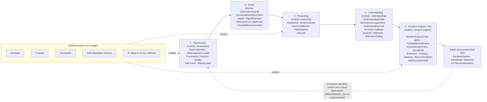

# Aurora — System Conceptual Map

> The reasoning ladder and its guarantees, at a glance. Faithful reproduction of the
> "Mapa conceptual del sistema" diagram, kept in a version-controllable form and tied to the
> modules actually implemented in `src/modules/`.
>
> **Status (post Core Completion Review):** the reasoning core is **implemented end-to-end**.
> All five stages exist in code and Implementation 006 composes them into one demonstrated chain
> whose first full output is `DecisionSupport` with `VoiceMode: Reflection` — not `Recommendation`.
> The remaining absences (UI/API/DB/LLM/event-bus/FIT/athlete module/production service) are
> **intentional**, not gaps. See [`../implementation-architecture/CORE_COMPLETION_REVIEW.md`](../implementation-architecture/CORE_COMPLETION_REVIEW.md).

> **Canonical source:** this Markdown/Mermaid document is the **canonical, maintainable, versionable
> source of truth** for the system map. Edit the map here.
>
> **The PNG is a derived export, not a source.** A rendered raster (`aurora-system-map.png`) may be
> added beside this file *later*, once a corrected, final version exists — strictly as a derived
> render of this document, never as the principal artifact. It is intentionally not committed now.

---

## Central Principle

> **Aurora no confunde datos con significado, ni inferencia con hecho, ni comprensión con consejo.**
> *(Aurora does not confuse data with meaning, inference with fact, or understanding with advice.)*

---

## The Reasoning Ladder



[FACT] **End-to-end proof (Implementation 006).** A single synthetic chain runs all five stages and
lands on `DecisionSupport` with `VoiceMode: Reflection`. A single `supported` outcome earns
`UnderstandingLevel: Working` → `SafeVoiceCeiling: tentative` → max voice `Reflection`; complete
traceability and clean gates are **not** enough for `Recommendation` (that also requires a
`confident` ceiling). Restraint is structural, not a runtime preference.

[FACT] **Athlete is not a pipeline stage.** It is the cross-cutting context every stage consults
(purpose, identity, constraints, path-dependent memory). **Understanding sits above the flow**,
governing how assertively Decision Support may speak. The flow is **cyclic**: the athlete's
decision returns as a new observation.

---

## Operational Reasoning Ladder

```text
Observation  >  Signal  >  Hypothesis  >  Understanding  >  Voice
```

---

## The Five Stages

| # | Stage | Module | Holds | Implemented |
|---|---|---|---|---|
| 1 | **Observación** | `observation` | `ObservationSet`, raw observations, Provenance/Source/Quality, self-report, missing data | ✅ Impl 001 |
| 2 | **Señal** | `observation/signal` | `ContextualizedObservation`, `Signal`/`SignalRejection`, relevance-without-meaning, preserved traceability | ✅ Impl 002 |
| 3 | **Reasoning** | `reasoning` | `Hypothesis`, `EvidenceCase`, claim confidence, falsifiers, lifecycle | ✅ Impl 003 |
| 4 | **Understanding** | `understanding` | `UnderstandingProfile`, dimension-specific, `UnderstandingLevel`, survived challenge, surprise/staleness, `SafeVoiceCeiling` | ✅ Impl 004 |
| 5 | **Decision Support / Voz** | `decision-support` | `DecisionSupportCase`, gates, `TraceabilityVerification`, `VoiceSelectionPolicy`, `VoiceMode` (Reflection/Framing/Warning/Recommendation), terminal outputs, preserved agency | ✅ Impl 005 |
| — | **End-to-end proof** | `src/modules/__tests__` | First full chain composed; output `DecisionSupport` · `VoiceMode: Reflection` (not Recommendation) | ✅ Impl 006 |

---

## Non-Negotiable Invariants

- **Trazabilidad end-to-end** — every claim traceable back to provenance-bearing observations.
- **Incertidumbre explícita** — "I don't know yet" is a first-class, representable output.
- **Comprensión por dimensión** — understanding is dimension-specific, never global.
- **El atleta decide** — Aurora supports decisions; it never owns them.
- **El silencio también es una salida válida** — responsible withholding is auditable, not absence.

---

## Distinctions the Map Must Not Collapse

[FACT] Four pairs the code keeps as distinct, unrepresentable-to-confuse concepts:

| Distinct concepts | Why they are not the same |
|---|---|
| `SafeVoiceCeiling` **≠** `VoiceMode` | The ceiling (from `understanding`: none/tentative/qualified/confident) is the *maximum permitted assertiveness*; the `VoiceMode` (Silence/Reflection/Framing/Warning/Recommendation) is what `decision-support` actually selects within it. The ceiling is mapped to a voice; it is never a voice. |
| `Signal` **≠** `Evidence` | A `Signal` asserts only *possible relevance to a future question*. It becomes an `EvidenceCase` **only** when attached inside a `Hypothesis` — there is no standalone evidence. |
| `ClaimConfidence` **≠** `UnderstandingLevel` | Confidence is *in a claim* (calibrated, defeasible, per-hypothesis); understanding level is *in Aurora's grasp of this athlete* (per-dimension, earned by survived challenge). The `ReasoningOutcome` adapter deliberately drops claim confidence so it cannot leak into understanding. |
| `DecisionSupportCase` **≠** `AthleteDecision` | Aurora owns the *integrity of support*; the athlete owns the *decision*. The case only **references** an `AthleteDecision` after the fact (`AthleteDecisionRef`); it never owns one. |

---

## What the System Still Does Not Have (intentional)

[FACT] The reasoning core is complete in code; the following are **deliberately absent**, not failures:

- **No UI** · **No API** · **No DB / persistence**
- **No LLM rendering** boundary (generated text must never become domain truth)
- **No event bus**
- **No Garmin/FIT adapter** (the first input is a synthetic fixture)
- **No real `athlete` module** (purpose/risk/constraints enter as placeholders)
- **No production orchestration service** (the end-to-end seam is an integration test harness)

[ASSUMPTION] Each was excluded so the core's invariants could be proven *before* the surfaces most
likely to erode them are introduced. The next responsible missions (Spec 007 purpose change, Spec 008
projection refresh, Spec 009 athlete-decision loop, then persistence/event surface and input adapters)
add these without collapsing any distinction above. See the Core Completion Review for the full ledger.

---

## How This Maps to the Repository

- The five stages correspond to the technical boundary map in
  [`../implementation-architecture/TECHNICAL_BOUNDARY_MAP.md`](../implementation-architecture/TECHNICAL_BOUNDARY_MAP.md).
- The full conceptual foundation is indexed at [`../README.md`](../README.md) and
  [`../domain-modeling/README.md`](../domain-modeling/README.md).
- Dependencies flow up the ladder only: `observation → reasoning → understanding → decision-support`,
  with `Athlete` and `Understanding` as cross-cutting contexts. Lower modules never import higher ones
  (enforced by dependency-boundary tests in each module's `tests/`).

---

*This diagram is documentation, not code. It tracks the implemented system; update it as new slices land.*
