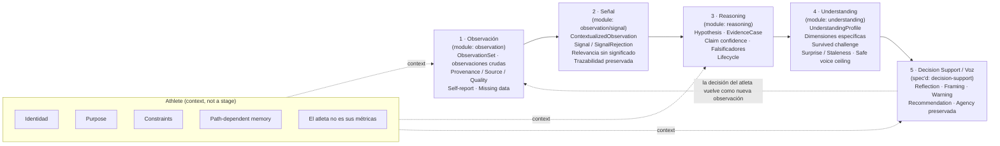

# Aurora — System Conceptual Map

> The reasoning ladder and its guarantees, at a glance. Faithful reproduction of the
> "Mapa conceptual del sistema" diagram, kept in a version-controllable form and tied to the
> modules actually implemented in `src/modules/`.

> **Canonical source:** this Markdown/Mermaid document is the **canonical, maintainable, versionable
> source of truth** for the system map. Edit the map here.
>
> **The PNG is a derived export, not a source.** A rendered raster (`aurora-system-map.png`) may be
> added beside this file *later*, once a corrected, final version exists — strictly as a derived
> render of this document, never as the principal artifact. It is intentionally not committed now.

---

## Central Principle

> **Aurora no confunde datos con significado, ni inferencia con hecho, ni comprensión con consejo.**
> *(Aurora does not confuse data with meaning, inference with fact, or understanding with advice.)*

---

## The Reasoning Ladder



[FACT] **Athlete is not a pipeline stage.** It is the cross-cutting context every stage consults
(purpose, identity, constraints, path-dependent memory). **Understanding sits above the flow**,
governing how assertively Decision Support may speak. The flow is **cyclic**: the athlete's
decision returns as a new observation.

---

## Operational Reasoning Ladder

```text
Observation  >  Signal  >  Hypothesis  >  Understanding  >  Voice
```

---

## The Five Stages

| # | Stage | Module | Holds | Implemented |
|---|---|---|---|---|
| 1 | **Observación** | `observation` | `ObservationSet`, raw observations, Provenance/Source/Quality, self-report, missing data | ✅ Impl 001 |
| 2 | **Señal** | `observation/signal` | `ContextualizedObservation`, `Signal`/`SignalRejection`, relevance-without-meaning, preserved traceability | ✅ Impl 002 |
| 3 | **Reasoning** | `reasoning` | `Hypothesis`, `EvidenceCase`, claim confidence, falsifiers, lifecycle | ✅ Impl 003 |
| 4 | **Understanding** | `understanding` | `UnderstandingProfile`, dimension-specific, survived challenge, surprise/staleness, safe voice ceiling | ✅ Impl 004 |
| 5 | **Decision Support / Voz** | `decision-support` | Reflection, Framing, Warning, Recommendation, preserved agency | 📋 Spec 005 (not implemented) |

---

## Non-Negotiable Invariants

- **Trazabilidad end-to-end** — every claim traceable back to provenance-bearing observations.
- **Incertidumbre explícita** — "I don't know yet" is a first-class, representable output.
- **Comprensión por dimensión** — understanding is dimension-specific, never global.
- **El atleta decide** — Aurora supports decisions; it never owns them.
- **El silencio también es una salida válida** — responsible withholding is auditable, not absence.

---

## How This Maps to the Repository

- The five stages correspond to the technical boundary map in
  [`../implementation-architecture/TECHNICAL_BOUNDARY_MAP.md`](../implementation-architecture/TECHNICAL_BOUNDARY_MAP.md).
- The full conceptual foundation is indexed at [`../README.md`](../README.md) and
  [`../domain-modeling/README.md`](../domain-modeling/README.md).
- Dependencies flow up the ladder only: `observation → reasoning → understanding → decision-support`,
  with `Athlete` and `Understanding` as cross-cutting contexts. Lower modules never import higher ones
  (enforced by dependency-boundary tests in each module's `tests/`).

---

*This diagram is documentation, not code. It tracks the implemented system; update it as new slices land.*
