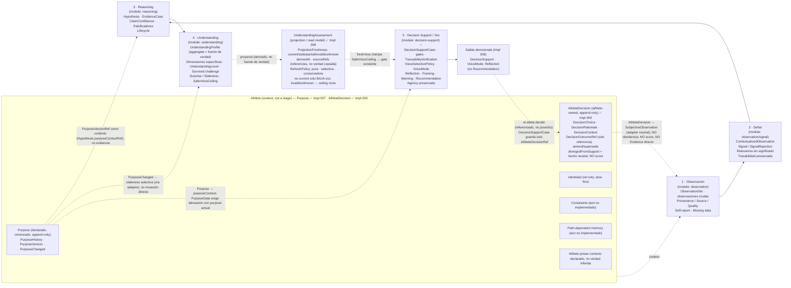

# Aurora — System Conceptual Map

> The reasoning ladder and its guarantees, at a glance. Faithful reproduction of the
> "Mapa conceptual del sistema" diagram, kept in a version-controllable form and tied to the
> modules actually implemented in `src/modules/`.
>
> **Status (post Implementation 010):** the reasoning core is **implemented end-to-end**.
> All five stages exist in code and Implementation 006 composes them into one demonstrated chain
> whose first full output is `DecisionSupport` with `VoiceMode: Reflection` — not `Recommendation`.
> Implementation 007 added a thin, **Purpose-first `athlete` module**. Implementation 008 made
> **projection freshness explicit** on `UnderstandingAssessment` (non-current freshness only lowers the
> voice, via the existing `SafeVoiceCeiling`). Implementation 009 closed the **AthleteDecision feedback
> loop** — the decision returns as athlete-owned `Observation`, **referenced not owned**, with no
> obedience scoring. Implementation 010 added **persistence ports + in-memory repositories + validated
> `toState()`/`reconstitute()`** so every aggregate round-trips without corrupting invariants,
> traceability, freshness, or ownership — **with no production DB/ORM/schema/event-bus/cache/infrastructure
> chosen**. The remaining absences (UI/API/**production persistence**/LLM/event-bus/event-records/FIT/
> **full** athlete model/**generic projection engine**/**full DecisionOutcome**/production service) are
> **intentional**, not gaps. See
> [`../implementation-architecture/CORE_COMPLETION_REVIEW.md`](../implementation-architecture/CORE_COMPLETION_REVIEW.md).

> **Canonical source:** this Markdown/Mermaid document is the **canonical, maintainable, versionable
> source of truth** for the system map. Edit the map here.
>
> **The PNG is a derived export, not a source.** A rendered raster (`aurora-system-map.png`) may be
> added beside this file *later*, once a corrected, final version exists — strictly as a derived
> render of this document, never as the principal artifact. It is intentionally not committed now.

---

## Central Principle

> **Aurora no confunde datos con significado, ni inferencia con hecho, ni comprensión con consejo.**
> *(Aurora does not confuse data with meaning, inference with fact, or understanding with advice.)*

---

## The Reasoning Ladder



[FACT] **Athlete / Purpose is now an implemented upstream context (Impl 007), Purpose-only.** It is
**not** a pipeline stage and **not** the full Athlete aggregate. The edges from `Purpose` are
**explicit seams**, not hidden coupling: `athlete` imports no downstream module; purpose reaches
`reasoning` as a `PurposeVersionRef` *context handle* (carried in the existing
`Hypothesis.purposeContextRef` slot — **context, not evidence**), reaches `understanding` only as
**selective staleness** applied by a neutral adapter (**never a direct mutation, never a global
reset**), and reaches `decision-support` as a `PurposeContext` the `PurposeGate` evaluates (**purpose
context ≠ voice** — the case still selects the `VoiceMode`).

[FACT] **Projection freshness (Implementation 008).** `UnderstandingAssessment` is a **projection /
read model** of the `UnderstandingProfile` aggregate (the source of truth) — **not** a fact. It carries
explicit `ProjectionFreshness` (`current`/`stale`/`partial`/`invalid`/`unknown`), `derivedAt`, and
`sourceRefs` (references, never copied truth). Non-current freshness can **only lower** the voice;
`invalid`/`unknown` clamp `SafeVoiceCeiling` to `none` (→ `Withholding`). Freshness reaches
`decision-support` **only through the clamped `SafeVoiceCeiling`** — the consumer was **not modified**
and reads no freshness directly. The `RefreshPolicy` is **pure, deterministic, selective**
(by source-ref intersection) and **conservative**; **refresh = recompute** a new view, never edit the
old one. There is **no generic projection engine and no top-level `projection` module** — freshness is
local to `understanding` for this one projection.

[FACT] **AthleteDecision feedback loop (Implementation 009).** The athlete's decision is an
**athlete-owned, append-only** `AthleteDecision` inside `athlete` — `decision-support` records **only an
`AthleteDecisionRef`** (referenced, never owned). The loop's return arrow goes **back to Observation**:
a reported decision re-enters as a `SubjectiveObservation` via a **neutral harness adapter** (`athlete`
imports no `observation`), then travels the **full ladder** (Signal → EvidenceCase → Hypothesis →
Understanding) — **never** jumping straight to Signal/Evidence/Understanding. `divergedFromSupport` is
**neutral fact, not a compliance score**; following ≠ obedience-success, not-following ≠ failure; a
**modification is first-class** (no binary compliance); `DecisionOutcomeRef` is a **reference only** (no
full outcome object), and a **good/bad outcome never grades `SupportQuality`** (integrity-at-the-time).
There is **no compliance/obedience scoring and no outcome-based validation**.

[FACT] **Persistence ports + in-memory repositories (Implementation 010).** Persistence is a **seam
around the aggregates, not a stage and not a driver of the domain**. Each persisted boundary
(`ObservationSet`, `Hypothesis`, `UnderstandingProfile`, `DecisionSupportCase`, `Athlete`,
`AthleteDecisionRecord`) gained an additive, **validated** `toState()` / `reconstitute(state)` and a
module-owned **repository port** (`save`/`findById`/`exists`) with an **in-memory adapter**.
Adapters store **deep-copied state, not live references** (so loads are independent and mutation-isolated),
and **`reconstitute` validates invariants and rejects invalid state** — never a raw field bag. Round-trip
preserves append-only history, supersession, traceability refs, and (via a test helper) projection
freshness; `PurposeHistory` persists **through `Athlete`**; the `DecisionSupportCase` repo persists only an
`AthleteDecisionRef`, never an owned decision. **No technology is chosen** — no production DB/ORM/schema/
migrations, no event bus, no cache, no `src/infrastructure`, no projection repository, no event records.

[FACT] **End-to-end proof (Implementation 006).** A single synthetic chain runs all five stages and
lands on `DecisionSupport` with `VoiceMode: Reflection`. A single `supported` outcome earns
`UnderstandingLevel: Working` → `SafeVoiceCeiling: tentative` → max voice `Reflection`; complete
traceability and clean gates are **not** enough for `Recommendation` (that also requires a
`confident` ceiling). Restraint is structural, not a runtime preference.

[FACT] **Athlete is not a pipeline stage.** It is the cross-cutting context every stage consults
(purpose, identity, constraints, path-dependent memory). **Understanding sits above the flow**,
governing how assertively Decision Support may speak. The flow is **cyclic**: the athlete's
decision returns as a new observation.

---

## Operational Reasoning Ladder

```text
Observation  >  Signal  >  Hypothesis  >  Understanding  >  Voice
```

---

## The Five Stages

| # | Stage | Module | Holds | Implemented |
|---|---|---|---|---|
| 1 | **Observación** | `observation` | `ObservationSet`, raw observations, Provenance/Source/Quality, self-report, missing data | ✅ Impl 001 |
| 2 | **Señal** | `observation/signal` | `ContextualizedObservation`, `Signal`/`SignalRejection`, relevance-without-meaning, preserved traceability | ✅ Impl 002 |
| 3 | **Reasoning** | `reasoning` | `Hypothesis`, `EvidenceCase`, claim confidence, falsifiers, lifecycle | ✅ Impl 003 |
| 4 | **Understanding** | `understanding` | `UnderstandingProfile`, dimension-specific, `UnderstandingLevel`, survived challenge, surprise/staleness, `SafeVoiceCeiling` | ✅ Impl 004 |
| 5 | **Decision Support / Voz** | `decision-support` | `DecisionSupportCase`, gates, `TraceabilityVerification`, `VoiceSelectionPolicy`, `VoiceMode` (Reflection/Framing/Warning/Recommendation), terminal outputs, preserved agency | ✅ Impl 005 |
| — | **End-to-end proof** | `src/modules/__tests__` | First full chain composed; output `DecisionSupport` · `VoiceMode: Reflection` (not Recommendation) | ✅ Impl 006 |
| ※ | **Athlete / Purpose** *(context, not a stage)* | `athlete` | `Athlete` (thin), `Purpose`/`PurposeVersion`/`PurposeHistory` (append-only), `PurposeChanged`, `PurposeVersionRef`, `PurposeReinterpretationStatus` (type only). **No** inferred state/capacity/constraints/path-memory | ✅ Impl 007 (Purpose-first) |
| ◇ | **Projection freshness** *(on `UnderstandingAssessment`)* | `understanding` | `ProjectionFreshness` (5 states), `derivedAt`, source refs, `RefreshTrigger`/`Policy`; non-current only lowers voice (invalid/unknown → ceiling `none`); flows downstream via `SafeVoiceCeiling`. **No** generic engine / `projection` module / `ImpactAssessment` | ✅ Impl 008 |
| ↩ | **AthleteDecision feedback** *(context, not a stage)* | `athlete` | `AthleteDecision` (athlete-owned, append-only), `DecisionChoice`/`Rationale`/`Context`, `DecisionOutcomeRef` (ref only), `AthleteDecisionRecord` (amend/supersede); re-enters as `SubjectiveObservation` (neutral adapter). **No** compliance/obedience score / full `DecisionOutcome` / pattern engine | ✅ Impl 009 |
| 💾 | **Persistence** *(seam around aggregates, not a stage)* | each module's `application/` | Validated `toState()`/`reconstitute()` + repository ports (`save`/`findById`/`exists`) + in-memory adapters for the 6 boundaries; state copies (deep-copied), invalid-state rejected, round-trip preserves invariants/traceability/freshness/history. **No** DB/ORM/schema/migrations / event bus / cache / `infrastructure` / projection repository / event records | ✅ Impl 010 |

---

## Non-Negotiable Invariants

- **Trazabilidad end-to-end** — every claim traceable back to provenance-bearing observations.
- **Incertidumbre explícita** — "I don't know yet" is a first-class, representable output.
- **Comprensión por dimensión** — understanding is dimension-specific, never global.
- **El atleta decide** — Aurora supports decisions; it never owns them.
- **El silencio también es una salida válida** — responsible withholding is auditable, not absence.

---

## Distinctions the Map Must Not Collapse

[FACT] Pairs the code keeps as distinct, unrepresentable-to-confuse concepts:

| Distinct concepts | Why they are not the same |
|---|---|
| `SafeVoiceCeiling` **≠** `VoiceMode` | The ceiling (from `understanding`: none/tentative/qualified/confident) is the *maximum permitted assertiveness*; the `VoiceMode` (Silence/Reflection/Framing/Warning/Recommendation) is what `decision-support` actually selects within it. The ceiling is mapped to a voice; it is never a voice. |
| `Signal` **≠** `Evidence` | A `Signal` asserts only *possible relevance to a future question*. It becomes an `EvidenceCase` **only** when attached inside a `Hypothesis` — there is no standalone evidence. |
| `ClaimConfidence` **≠** `UnderstandingLevel` | Confidence is *in a claim* (calibrated, defeasible, per-hypothesis); understanding level is *in Aurora's grasp of this athlete* (per-dimension, earned by survived challenge). The `ReasoningOutcome` adapter deliberately drops claim confidence so it cannot leak into understanding. |
| `DecisionSupportCase` **≠** `AthleteDecision` | Aurora owns the *integrity of support*; the athlete owns the *decision*. The case only **references** an `AthleteDecision` after the fact (`AthleteDecisionRef`); it never owns one. |
| thin `Athlete`/`Purpose` module **≠** full `Athlete` aggregate | Only the Purpose slice is implemented (Impl 007); state/capacity/constraints/path-memory are not. |
| declared `Purpose` **≠** inferred athlete state | `athlete` owns the *given* (athlete-declared/accepted, versioned); it never holds readiness/capacity/fatigue/current-state. |
| `PurposeChanged` **≠** reasoning rewrite | A purpose change appends history and may stale understanding selectively; it never edits or auto-falsifies prior hypotheses. |
| `PurposeVersionRef` **≠** proof old reasoning used the new purpose | It is a context handle tagging which purpose was in force; it does not retroactively re-evaluate past reasoning. |
| revealed behavior **≠** declared purpose | Behavior may create an inquiry/hypothesis about a mismatch; it never silently overwrites the athlete's declared purpose. |
| purpose context **≠** decision-support voice | Purpose feeds the `PurposeGate`; the case still selects the `VoiceMode`. |
| selective staleness **≠** global understanding reset | A purpose change stales only the named dimension(s); other dimensions stay fresh. |
| projection (`UnderstandingAssessment`) **≠** source of truth | The `UnderstandingProfile` aggregate is the truth; the assessment is its derived, labeled view (Impl 008). |
| `ProjectionFreshness` **≠** traceability | Freshness says *how safe to consume*; `sourceRefs`/trace say *what it came from* — different axes. |
| projection `sourceRefs` **≠** copied source state | References back to real artifacts, never embedded/re-authored truth. |
| refresh **≠** mutate the old projection | Refresh *recomputes* a new view; `applyFreshness` never edits the old one (it stays auditable). |
| stale/partial/invalid/unknown **≠** permission to recommend | Non-current freshness can only *constrain*; invalid/unknown → ceiling `none` → `Withholding`. |
| `SafeVoiceCeiling` clamp **≠** decision-support owning freshness | The consumer reads the clamped ceiling; it never reads freshness — `decision-support` was not modified. |
| local freshness slice **≠** generic projection engine | Freshness lives in `understanding` for one projection; no engine / no `projection` module exists. |
| `AthleteDecision` **≠** Aurora output | The decision is the athlete's fact, not Aurora's product (Impl 009). |
| `AthleteDecisionRef` **≠** ownership | A reference recorded after the fact; `decision-support` never owns/mutates the decision. |
| divergence **≠** noncompliance · following **≠** obedience-success · not-following **≠** failure | `divergedFromSupport` is neutral fact; no valence/score is produced. |
| `DecisionOutcomeRef` **≠** outcome judgement | A handle to a separate, later observation; the outcome never grades the support. |
| `AthleteDecision → Observation` **≠** `AthleteDecision → Evidence` | Re-entry is observation-only; the full ladder runs afterward. |
| `SupportQuality` **≠** outcome quality | Integrity at the time of support; a good/bad outcome does not change it. |
| decision pattern **≠** athlete label | A pattern must become a falsifiable hypothesis; no personality tag / compliance profile. |
| decision rationale **≠** declared-purpose overwrite | Rationale may prompt inquiry/hypothesis; purpose changes only by athlete declaration/acceptance. |
| persistence ports **≠** production database | Impl 010 is ports + in-memory adapters; no DB/ORM/schema/migrations chosen. |
| in-memory repository **≠** infrastructure layer | Adapters are module-local test support; there is no `src/infrastructure`. |
| `toState()` **≠** domain authority · `reconstitute()` **≠** raw field-bag bypass | State export is an adapter contract; rehydration validates invariants and rejects invalid state. |
| persisted state **≠** current truth · repository round-trip **≠** event sourcing | A store is "as-of"; it replays nothing and owns no occurrences (event records are future work). |
| traceability refs **≠** database foreign keys | The domain trace is reference handles; any FK would be an adapter detail, not the meaning. |
| projection-freshness survival helper **≠** projection repository | Freshness survival is proven by a test `Map`; no production projection store exists. |
| state copy **≠** live domain-object reference | Adapters deep-copy on save and load; two finds are independent. |

---

## What the System Still Does Not Have (intentional)

[FACT] The reasoning core is complete in code; `athlete` holds Purpose + AthleteDecision; projection
freshness is explicit on `UnderstandingAssessment`; **persistence is ports + in-memory repositories**
(Impl 010); the following are **deliberately absent**, not failures:

- **No UI** · **No API** · **No production DB/ORM/schema/migrations** (persistence is ports + in-memory only) · **No cache**
- **No LLM rendering** boundary (generated text must never become domain truth)
- **No event bus** (`PurposeChanged`, refresh triggers, and decision feedback are returned/derived values, not bus events)
- **No Garmin/FIT adapter** (the first input is a synthetic fixture)
- **No *full* `athlete` model** — Purpose + AthleteDecision slices are implemented; **inferred state, capacity,
  readiness, fatigue, constraints, and path-dependent memory are not** (risk still enters as a placeholder)
- **No compliance/obedience scoring and no outcome-based validation** (Impl 009): `divergedFromSupport` is
  neutral fact; the outcome never grades `SupportQuality`; **no full `DecisionOutcome` object / no pattern engine**
- **No reinterpretation engine** (the `PurposeReinterpretationStatus` type ships; the engine does not)
- **No generic projection engine and no top-level `projection` module** — freshness is local to
  `understanding` for the one concrete projection; **no `ImpactAssessment`** second projection yet
- **No event records / event bus** — the persistence paper's event surface is conceptual; records are Spec 011
- **No production orchestration service** (cross-module purpose/refresh/decision seams live in the neutral test harness)

[ASSUMPTION] Each was excluded so the core's invariants could be proven *before* the surfaces most
likely to erode them are introduced. **Spec 007 (purpose change), Spec 008 (projection freshness),
Spec 009 (athlete-decision feedback), and Spec 010 (persistence ports + in-memory repositories) are
done (Impl 007/008/009/010).** The next responsible missions (Spec 011 domain event/outcome records +
traceability envelope, then the reasoning reinterpretation engine, then a real persistence/ingestion
backend) add the rest without collapsing any distinction above. See the Core Completion Review for the
full ledger.

---

## How This Maps to the Repository

- The five stages correspond to the technical boundary map in
  [`../implementation-architecture/TECHNICAL_BOUNDARY_MAP.md`](../implementation-architecture/TECHNICAL_BOUNDARY_MAP.md).
- The full conceptual foundation is indexed at [`../README.md`](../README.md) and
  [`../domain-modeling/README.md`](../domain-modeling/README.md).
- Dependencies flow up the ladder only: `observation → reasoning → understanding → decision-support`,
  with `Athlete` and `Understanding` as cross-cutting contexts. Lower modules never import higher ones
  (enforced by dependency-boundary tests in each module's `tests/`).
- `athlete` (Impl 007 + 009) is an **upstream leaf**: it imports only `shared-kernel` and **never** imports
  `observation`/`reasoning`/`understanding`/`decision-support`. Purpose and decisions reach downstream
  through **explicit seams** — a `PurposeVersionRef` context handle into `Hypothesis.purposeContextRef`, a
  `PurposeContext` into `decision-support`, selective `markUnderstandingStale("purpose-change")` into
  `understanding`, and an `AthleteDecision` → `SubjectiveObservation` re-entry — all applied by neutral
  harness/application adapters, not by `athlete` reaching out (enforced by `athlete`'s boundary test).
- **Persistence (Impl 010)** lives in each module's `application/`: a repository **port** + **in-memory
  adapter** per aggregate, plus a validated `toState()`/`reconstitute()` on the aggregate. Ports/adapters
  import only their **owning module + `shared-kernel`** (enforced by a persistence-boundary test); there is
  **no `src/infrastructure`** and **no `persistence`/`repositories` module**. The store preserves the
  model; it never becomes it.

---

*This diagram is documentation, not code. It tracks the implemented system; update it as new slices land.*
