# Aurora — System Conceptual Map

> The reasoning ladder and its guarantees, at a glance. Faithful reproduction of the
> "Mapa conceptual del sistema" diagram, kept in a version-controllable form and tied to the
> modules actually implemented in `src/modules/`.
>
> **Status (post Implementation 015):** the reasoning core is **implemented end-to-end**.
> All five stages exist in code and Implementation 006 composes them into one demonstrated chain
> whose first full output is `DecisionSupport` with `VoiceMode: Reflection` — not `Recommendation`.
> Implementation 007 added a thin, **Purpose-first `athlete` module**. Implementation 008 made
> **projection freshness explicit** on `UnderstandingAssessment` (non-current freshness only lowers the
> voice, via the existing `SafeVoiceCeiling`). Implementation 009 closed the **AthleteDecision feedback
> loop** — the decision returns as athlete-owned `Observation`, **referenced not owned**, with no
> obedience scoring. Implementation 010 added **persistence ports + in-memory repositories + validated
> `toState()`/`reconstitute()`** so every aggregate round-trips without corrupting invariants,
> traceability, freshness, or ownership — **with no production DB/ORM/schema/event-bus/cache/infrastructure
> chosen**. Implementation 011 added the **dependency-neutral `event-recording` module** — an
> **append-only, ref-only** `DomainEventRecord` log (categories `occurrence`/`outcome`) with a
> `TraceabilityEnvelope`, recording *what happened* **without** becoming a command, copied state, a
> projection, source truth, a bus, or event sourcing — **complementing** the aggregate repositories, not
> replacing them. Implementation 012 added a **neutral check-only reprojection harness** (test-support,
> **not a production module**) that recomputes `UnderstandingAssessment` through the owning module,
> recalculates freshness, detects candidates from event records (context only), and **reports**
> drift/findings — **mutating nothing, executing no event, rebuilding nothing from the log, promoting no
> freshness, and turning no projection into truth**. Implementation 013 added the first real **"data in"**
> boundary — an **`observation`-owned Manual Input Adapter** that records manual input faithfully as an
> `ObservationSet` (verbatim words, explicit missing data, provenance `source: "manual"`, quality),
> persists through `ObservationSetRepository`, and rejects the unrepresentable — **without interpreting,
> detecting a `Signal`, reasoning, mutating athlete records, importing `event-recording`, or triggering
> any downstream effect**. Implementation 014 added the first real **"output out"** boundary — a
> **deterministic `rendering` module** that turns a domain-approved `TerminalOutput` into human-facing text
> via a fake renderer + a **mandatory validator**, preserving voice/uncertainty/limitations/freshness/
> traceability/agency — **without becoming domain authority, selecting voice, escalating tone, inventing a
> fact, mutating an aggregate, or writing an event**. Implementation 015 made the output-out cycle
> **auditable**: an append-only **`RenderedMessageRecord`** + a display-safety **`RenderReview`** + a derived
> **`DisplayEligibility`** (repository port + in-memory adapter, inside `rendering`) — **persistence is
> auditability, not authority**: a record is never domain truth, approval strengthens nothing, rejection
> invalidates nothing, failed attempts are never display-eligible, and nothing emits an event or triggers
> delivery. The remaining absences (**delivery / UI / API**/**real LLM provider & prompts**/external FIT
> ingestion/**rendered-output events**/**production persistence & event store**/**event bus**/**full**
> athlete model/**generic projection engine**/**full DecisionOutcome**/**production reprojection service &
> scheduler & projection repository**/**event sourcing**/production service) are **intentional**, not gaps. See
> [`../implementation-architecture/CORE_COMPLETION_REVIEW.md`](../implementation-architecture/CORE_COMPLETION_REVIEW.md).

> **Canonical source:** this Markdown/Mermaid document is the **canonical, maintainable, versionable
> source of truth** for the system map. Edit the map here.
>
> **The PNG is a derived export, not a source.** A rendered raster (`aurora-system-map.png`) may be
> added beside this file *later*, once a corrected, final version exists — strictly as a derived
> render of this document, never as the principal artifact. It is intentionally not committed now.

---

## Central Principle

> **Aurora no confunde datos con significado, ni inferencia con hecho, ni comprensión con consejo.**
> *(Aurora does not confuse data with meaning, inference with fact, or understanding with advice.)*

---

## The Reasoning Ladder

```mermaid
flowchart LR
    subgraph ATH["Athlete (context, not a stage) — Purpose ✅ Impl 007 · AthleteDecision ✅ Impl 009"]
      A2["Purpose (declarado, versionado, append-only)<br/>PurposeHistory · PurposeVersion · PurposeChanged"]
      AD["AthleteDecision (athlete-owned, append-only) ✅ Impl 009<br/>DecisionChoice · DecisionRationale · DecisionContext<br/>DecisionOutcomeRef (solo referencia) · amend/supersede<br/>divergedFromSupport = hecho neutral, NO score"]
      A1["Identidad (ref only, slice fino)"]
      A3["Constraints (aún no implementado)"]
      A4["Path-dependent memory (aún no implementado)"]
      A5["Athlete posee contexto declarado, no verdad inferida"]
    end

    O["1 · Observación<br/>(module: observation)<br/>ObservationSet · observaciones crudas<br/>Provenance / Source / Quality<br/>Self-report · Missing data"]
    S["2 · Señal<br/>(module: observation/signal)<br/>ContextualizedObservation<br/>Signal / SignalRejection<br/>Relevancia sin significado<br/>Trazabilidad preservada"]
    R["3 · Reasoning<br/>(module: reasoning)<br/>Hypothesis · EvidenceCase<br/>ClaimConfidence · Falsificadores<br/>Lifecycle"]
    U["4 · Understanding<br/>(module: understanding)<br/>UnderstandingProfile (aggregate = fuente de verdad)<br/>Dimensiones específicas · UnderstandingLevel · Survived challenge<br/>Surprise / Staleness · SafeVoiceCeiling"]
    UA["UnderstandingAssessment (projection / read model) ✅ Impl 008<br/>ProjectionFreshness: current/stale/partial/invalid/unknown<br/>derivedAt · sourceRefs (referencias, no verdad copiada)<br/>RefreshPolicy: pura · selectiva · conservadora<br/>no-current solo BAJA voz; invalid/unknown → ceiling none"]
    D["5 · Decision Support / Voz<br/>(module: decision-support) ✅<br/>DecisionSupportCase · gates · TraceabilityVerification<br/>VoiceSelectionPolicy · VoiceMode<br/>Reflection · Framing · Warning · Recommendation<br/>Agency preservada"]
    OUT["Salida demostrada (Impl 006)<br/>DecisionSupport · VoiceMode: Reflection<br/>(no Recommendation)"]

    MIN["Entrada manual ✅ Impl 013 (observation/application)<br/>ManualInputSubmission → ingestManualInput<br/>accepted / partially-accepted / rejected<br/>palabras verbatim · missing data explícito · provenance source manual<br/>persiste vía ObservationSetRepository<br/>NO UI/API/LLM · NO interpreta · NO Signal · NO downstream"]
    MIN -- "registra fielmente como ObservationSet (NO significado, NO Signal)" --> O

    O --> S --> R --> U
    U -. "proyecta (derivado, no fuente de verdad)" .-> UA
    UA -. "freshness clampa SafeVoiceCeiling → gate existente" .-> D
    D --> OUT
    REND["Rendering ✅ Impl 014 (downstream, NO dominio)<br/>RenderableDomainOutput (proyección read-only)<br/>fake renderer determinístico + validator OBLIGATORIO<br/>preserva voz/incertidumbre/limitaciones/freshness/traza/agencia<br/>voz puede igualar o suavizar, NUNCA escalar<br/>NO autoridad · NO selecciona voz · NO muta · NO evento · NO persiste"]
    HUMAN["Texto humano (presentación)<br/>RenderedMessage — NO es fuente de verdad"]
    OUT -- "presentación: expresa el TerminalOutput (no decide, no escala voz)" --> REND
    REND --> HUMAN
    RREC["Registro/Review de presentación ✅ Impl 015 (dentro de rendering)<br/>RenderedMessageRecord (append-only, auditable)<br/>RenderReview (display-safety) · status derivado<br/>DisplayEligibility derivada (no delivery, no aprobación de dominio)<br/>repository port + in-memory adapter<br/>auditabilidad, NO autoridad · NO muta dominio · NO evento · NO delivery"]
    REND -- "registra/revisa artefacto de presentación (auditoría, no autoridad)" --> RREC
    OUT -. "el atleta decide (referenciado, no poseído): DecisionSupportCase guarda solo AthleteDecisionRef" .-> AD
    AD -. "AthleteDecision → SubjectiveObservation (adapter neutral); NO obediencia, NO score, NO Evidence directo" .-> O

    ATH -. context .-> O
    A2 -. "PurposeVersionRef como contexto (Hypothesis.purposeContextRef), no evidencia" .-> R
    A2 -. "PurposeChanged → staleness selectiva (vía adapter), no mutación directa" .-> U
    A2 -. "Purpose → purposeContext; PurposeGate exige alineación con purpose actual" .-> D

    subgraph SEAMS["Support seams (no son etapas del razonamiento)"]
      PERSIST["Persistencia ✅ Impl 010<br/>repository ports + in-memory adapters<br/>toState()/reconstitute() validado<br/>guarda el estado del aggregate (copias, no refs vivas)<br/>responde: ¿qué ES el aggregate ahora?"]
      EVREC["event-recording ✅ Impl 011<br/>DomainEventRecord (occurrence/outcome) · catálogo cerrado<br/>TraceabilityEnvelope · EventPayloadRef (ref-only)<br/>log append-only · causation=linaje / correlation=grupo<br/>responde: ¿qué PASÓ? — NO comando, NO bus, NO ejecución"]
      REPRO["reprojection-harness ✅ Impl 012<br/>(test-support neutral, NO módulo productivo)<br/>check-only · recompute UnderstandingAssessment vía understanding<br/>recalcula freshness · detecta candidatos desde event records (contexto)<br/>reporta drift/findings · NO muta, NO ejecuta, NO reconstruye, NO promueve<br/>responde: ¿qué vistas derivadas recomputar / marcar stale?"]
    end

    LADDER["Etapas 1–5 + Athlete (ocurrencias)"]
    O -.- LADDER
    D -.- LADDER
    AD -.- LADDER
    LADDER -. "ocurrencias → registro (append-only, ref-only); NO ejecuta nada" .-> EVREC
    LADDER -. "aggregates ⇄ estado (round-trip validado)" .-> PERSIST
    EVREC -. "complementa, NO reemplaza, los repositories" .- PERSIST
    PERSIST -. "estado actual del aggregate (read)" .-> REPRO
    EVREC -. "candidatos/contexto (NO replay, NO comando, NO rebuild)" .-> REPRO
    REPRO -. "recompute vía understanding (no razona, no muta)" .- U
    REPRO -. "reporta drift/freshness/findings (no overwrite, no output)" .-> REPRO
```



[FACT] **Reprojection is a neutral, check-only support seam (Implementation 012), not a stage and not a
production module.** It lives under `src/modules/__tests__/reprojection-harness/`. It answers *"given
current aggregate/source state and occurrence history, what derived views should be recomputed or
considered stale?"* — it **recomputes** `UnderstandingAssessment` **through the owning `understanding`
function** (it coordinates, it does not reason), **recalculates** the 5-state freshness (re-deriving only
the **same or a more cautious** view — never promoting), reads **event records as candidates/context
only**, and **reports** drift/findings. The dashed edges into it are **reads**, not control flow: a run
**executes no event, rebuilds no aggregate from the log** (empty repos → `event-record-only`/
`missing-source`), **mutates no repository**, and creates **no** `TerminalOutput`/recommendation/
`SupportQuality` rewrite/`Purpose` overwrite/`DomainEventRecord`. `check-only` is the only implemented
mode; `refresh-derived`/`mark-stale` are reserved and throw. There is **no production `reprojection`
module, scheduler, event sourcing, or projection repository**.

[FACT] **Manual Input Adapter — the first real "data in" boundary (Implementation 013).** It lives in
`observation/application` and is an **ingress into `ObservationSet`**, drawn *before* Observation/Signal/
Reasoning. It records manual input **faithfully** — verbatim subjective `words`, **explicit** missing
data, **provenance** (`source: "manual"`) and quality — via the existing `recordObservationSet`, and
persists **only** through `ObservationSetRepository`. Its outcomes are `accepted` / `partially-accepted`
(faithful entries only + reported limitations) / `rejected` (saves nothing). The ingress arrow shows
**faithful recording, not interpretation**: there is **no arrow** from manual input to `Signal`,
`Evidence`, `Hypothesis`, `Understanding`, or `DecisionSupport`; the adapter **detects no `Signal`**,
**infers nothing** (no fatigue/readiness/impact), **invents no value**, **mutates no `AthleteDecisionRecord`**,
and **imports no downstream module or `event-recording`**. An optional `ObservationSetRecorded` is composed
**only in a neutral harness** from a **ref-only** event candidate — neutral, not command execution. There
is **no UI/API/LLM/external integration**. *Manual input is source material, never meaning.*

[FACT] **Rendering — the first real "output out" boundary (Implementation 014).** It lives in
`src/modules/rendering` and sits **downstream of `decision-support`**, drawn *after* the `TerminalOutput`.
`decision-support` owns the `TerminalOutput` and the `VoiceMode`; rendering owns **phrasing only**: it reads
a **read-only `RenderableDomainOutput`** projection and produces human-facing text via a **deterministic
fake renderer** (no provider, no model, no randomness) that **must pass a mandatory validator** before
becoming a `RenderedMessage`. The presentation arrow from the terminal output to rendering is **one-way**:
there is **no arrow back** to Observation/Reasoning/Understanding/DecisionSupport, **no mutation** of any
aggregate, and **no event-writing** arrow. **Voice may match or soften, never escalate**; `Inquiry` stays a
question; `Withholding` stays a refusal; `Recommendation` preserves conditions/uncertainty/traceability/
agency; invented facts/citations, hidden uncertainty/limitations, unsupported style/locale, and unsafe
athlete-state/purpose/compliance language are **rejected** (safe non-render). A `RenderedMessage` is **not
domain authority** — not `Evidence`/`Observation`/`Understanding`/`AthleteDecision`, not source truth (it
re-enters only if the athlete separately reports it via the manual adapter). There is **no real LLM
provider, prompt template, UI, API, or external call**. *Generated text is a presentation artifact, never authority.*

[FACT] **Rendered-message record / review — the first auditable output-out cycle (Implementation 015).**
**Inside `rendering`** (not a new module), downstream of the renderer: an **append-only `RenderedMessageRecord`**
(auditable presentation artifact that **preserves the source domain output ref**, terminal-output kind,
`VoiceMode`, validation/preservation flags, renderer kind, `createdAt`), an **append-only `RenderReview`**
history (closed 5-decision / 11-reason catalogs; **display-safety only**) with **derived** current status,
and a **derived `DisplayEligibility`** (rendered + `approved-for-display` + not superseded + source ref +
flags intact). It lives behind a **repository port + in-memory adapter** (deep-copy round-trip, mutation
isolation, validated reconstitution). The audit/review edge is **one-way**: **no arrow back** to the domain,
**no mutation** of any output, **no event-writing** arrow, **no delivery**. **Persistence is auditability,
not authority**: a record is **not** domain truth (`≠ Observation/Evidence/Understanding/DecisionSupport/
AthleteDecision`); **approval** changes no `VoiceMode`/traceability/freshness/`SupportQuality` and creates no
`Recommendation`; **rejection** invalidates nothing; **failed** attempts are auditable but never
display-eligible/approvable; **revision/supersession** preserve the old record (no overwrite, no deletion);
**display eligibility is not delivery**. **`rendering` imports no `event-recording`**, the **event catalog is
not expanded**, the repo is **in-memory** (no production DB), and there is **no delivery/UI/API/provider**.
*Persisting or approving rendered text improves auditability and display safety only.*

[FACT] **`event-recording` and persistence are *support seams*, not stages and not a bus.** Neither sits
in the epistemic ladder. Persistence (Impl 010) answers *"what is the aggregate now?"* (state round-trip);
`event-recording` (Impl 011) answers *"what happened?"* (an append-only, ref-only log of occurrences).
The dashed edges into them are **observational, not control flow** — a stage's occurrence is *recorded*,
never *commanded*; appending a `DomainEventRecord` executes nothing. The two seams **complement** each
other and never merge: a record references artifacts (by `kind`+`id`), it never copies aggregate state,
and the log is **not** an event-sourcing rebuild path (aggregates rebuild via `reconstitute`). There is
**no event bus, publish/subscribe, handler, or async delivery** anywhere in the map.

[FACT] **Athlete / Purpose is now an implemented upstream context (Impl 007), Purpose-only.** It is
**not** a pipeline stage and **not** the full Athlete aggregate. The edges from `Purpose` are
**explicit seams**, not hidden coupling: `athlete` imports no downstream module; purpose reaches
`reasoning` as a `PurposeVersionRef` *context handle* (carried in the existing
`Hypothesis.purposeContextRef` slot — **context, not evidence**), reaches `understanding` only as
**selective staleness** applied by a neutral adapter (**never a direct mutation, never a global
reset**), and reaches `decision-support` as a `PurposeContext` the `PurposeGate` evaluates (**purpose
context ≠ voice** — the case still selects the `VoiceMode`).

[FACT] **Projection freshness (Implementation 008).** `UnderstandingAssessment` is a **projection /
read model** of the `UnderstandingProfile` aggregate (the source of truth) — **not** a fact. It carries
explicit `ProjectionFreshness` (`current`/`stale`/`partial`/`invalid`/`unknown`), `derivedAt`, and
`sourceRefs` (references, never copied truth). Non-current freshness can **only lower** the voice;
`invalid`/`unknown` clamp `SafeVoiceCeiling` to `none` (→ `Withholding`). Freshness reaches
`decision-support` **only through the clamped `SafeVoiceCeiling`** — the consumer was **not modified**
and reads no freshness directly. The `RefreshPolicy` is **pure, deterministic, selective**
(by source-ref intersection) and **conservative**; **refresh = recompute** a new view, never edit the
old one. There is **no generic projection engine and no top-level `projection` module** — freshness is
local to `understanding` for this one projection.

[FACT] **AthleteDecision feedback loop (Implementation 009).** The athlete's decision is an
**athlete-owned, append-only** `AthleteDecision` inside `athlete` — `decision-support` records **only an
`AthleteDecisionRef`** (referenced, never owned). The loop's return arrow goes **back to Observation**:
a reported decision re-enters as a `SubjectiveObservation` via a **neutral harness adapter** (`athlete`
imports no `observation`), then travels the **full ladder** (Signal → EvidenceCase → Hypothesis →
Understanding) — **never** jumping straight to Signal/Evidence/Understanding. `divergedFromSupport` is
**neutral fact, not a compliance score**; following ≠ obedience-success, not-following ≠ failure; a
**modification is first-class** (no binary compliance); `DecisionOutcomeRef` is a **reference only** (no
full outcome object), and a **good/bad outcome never grades `SupportQuality`** (integrity-at-the-time).
There is **no compliance/obedience scoring and no outcome-based validation**.

[FACT] **Persistence ports + in-memory repositories (Implementation 010).** Persistence is a **seam
around the aggregates, not a stage and not a driver of the domain**. Each persisted boundary
(`ObservationSet`, `Hypothesis`, `UnderstandingProfile`, `DecisionSupportCase`, `Athlete`,
`AthleteDecisionRecord`) gained an additive, **validated** `toState()` / `reconstitute(state)` and a
module-owned **repository port** (`save`/`findById`/`exists`) with an **in-memory adapter**.
Adapters store **deep-copied state, not live references** (so loads are independent and mutation-isolated),
and **`reconstitute` validates invariants and rejects invalid state** — never a raw field bag. Round-trip
preserves append-only history, supersession, traceability refs, and (via a test helper) projection
freshness; `PurposeHistory` persists **through `Athlete`**; the `DecisionSupportCase` repo persists only an
`AthleteDecisionRef`, never an owned decision. **No technology is chosen** — no production DB/ORM/schema/
migrations, no event bus, no cache, no `src/infrastructure`, no projection repository, no event records.

[FACT] **End-to-end proof (Implementation 006).** A single synthetic chain runs all five stages and
lands on `DecisionSupport` with `VoiceMode: Reflection`. A single `supported` outcome earns
`UnderstandingLevel: Working` → `SafeVoiceCeiling: tentative` → max voice `Reflection`; complete
traceability and clean gates are **not** enough for `Recommendation` (that also requires a
`confident` ceiling). Restraint is structural, not a runtime preference.

[FACT] **Athlete is not a pipeline stage.** It is the cross-cutting context every stage consults
(purpose, identity, constraints, path-dependent memory). **Understanding sits above the flow**,
governing how assertively Decision Support may speak. The flow is **cyclic**: the athlete's
decision returns as a new observation.

---

## Operational Reasoning Ladder

```text
Observation  >  Signal  >  Hypothesis  >  Understanding  >  Voice
```

---

## The Five Stages

| # | Stage | Module | Holds | Implemented |
|---|---|---|---|---|
| ⌨ | **Entrada manual** *(ingress into ObservationSet, not a reasoning stage)* | `observation/application` | `ManualInputSubmission` → `ingestManualInput` → `accepted`/`partially-accepted`/`rejected`; verbatim words, explicit missing data, provenance `source: "manual"`, quality; persists via `ObservationSetRepository`. Records source material, never meaning; detects no Signal; imports no downstream module / `event-recording`. **No** UI/API/LLM/external integration | ✅ Impl 013 |
| 1 | **Observación** | `observation` | `ObservationSet`, raw observations, Provenance/Source/Quality, self-report, missing data | ✅ Impl 001 |
| 2 | **Señal** | `observation/signal` | `ContextualizedObservation`, `Signal`/`SignalRejection`, relevance-without-meaning, preserved traceability | ✅ Impl 002 |
| 3 | **Reasoning** | `reasoning` | `Hypothesis`, `EvidenceCase`, claim confidence, falsifiers, lifecycle | ✅ Impl 003 |
| 4 | **Understanding** | `understanding` | `UnderstandingProfile`, dimension-specific, `UnderstandingLevel`, survived challenge, surprise/staleness, `SafeVoiceCeiling` | ✅ Impl 004 |
| 5 | **Decision Support / Voz** | `decision-support` | `DecisionSupportCase`, gates, `TraceabilityVerification`, `VoiceSelectionPolicy`, `VoiceMode` (Reflection/Framing/Warning/Recommendation), terminal outputs, preserved agency | ✅ Impl 005 |
| — | **End-to-end proof** | `src/modules/__tests__` | First full chain composed; output `DecisionSupport` · `VoiceMode: Reflection` (not Recommendation) | ✅ Impl 006 |
| 🗣 | **Rendering** *(downstream presentation, not a reasoning stage, not domain)* | `rendering` | `RenderableDomainOutput` (read-only projection) → deterministic fake renderer + **mandatory validator** → `RenderedMessage`/`RenderOutcome`; voice may match/soften, never escalate; Inquiry stays a question, Withholding a refusal; uncertainty/limitations/freshness/traceability preserved; invented facts/escalation/unsafe requests rejected (safe non-render). Not domain authority; mutates/emits nothing; imports only `shared-kernel` + read-only `decision-support` types. **No** real LLM provider / prompt / UI / API / external call | ✅ Impl 014 |
| 🗄 | **Rendered-message record / review** *(audit of presentation, not domain; inside rendering)* | `rendering` (`domain`+`application`) | Append-only `RenderedMessageRecord` (source ref/kind/voice/flags preserved) + append-only `RenderReview` (closed catalogs; display-safety) + derived `DisplayEligibility`; repository port + in-memory adapter (mutation isolation, validated reconstitution). Auditability not authority; approval/rejection touch no domain; failed never display-eligible; revision/supersession preserve the old record. **No** events / delivery / production DB / UI / API / provider | ✅ Impl 015 |
| ※ | **Athlete / Purpose** *(context, not a stage)* | `athlete` | `Athlete` (thin), `Purpose`/`PurposeVersion`/`PurposeHistory` (append-only), `PurposeChanged`, `PurposeVersionRef`, `PurposeReinterpretationStatus` (type only). **No** inferred state/capacity/constraints/path-memory | ✅ Impl 007 (Purpose-first) |
| ◇ | **Projection freshness** *(on `UnderstandingAssessment`)* | `understanding` | `ProjectionFreshness` (5 states), `derivedAt`, source refs, `RefreshTrigger`/`Policy`; non-current only lowers voice (invalid/unknown → ceiling `none`); flows downstream via `SafeVoiceCeiling`. **No** generic engine / `projection` module / `ImpactAssessment` | ✅ Impl 008 |
| ↩ | **AthleteDecision feedback** *(context, not a stage)* | `athlete` | `AthleteDecision` (athlete-owned, append-only), `DecisionChoice`/`Rationale`/`Context`, `DecisionOutcomeRef` (ref only), `AthleteDecisionRecord` (amend/supersede); re-enters as `SubjectiveObservation` (neutral adapter). **No** compliance/obedience score / full `DecisionOutcome` / pattern engine | ✅ Impl 009 |
| 💾 | **Persistence** *(seam around aggregates, not a stage)* | each module's `application/` | Validated `toState()`/`reconstitute()` + repository ports (`save`/`findById`/`exists`) + in-memory adapters for the 6 boundaries; state copies (deep-copied), invalid-state rejected, round-trip preserves invariants/traceability/freshness/history. **No** DB/ORM/schema/migrations / event bus / cache / `infrastructure` / projection repository | ✅ Impl 010 |
| 🧾 | **Event recording** *(seam beside persistence, not a stage)* | `event-recording` | `DomainEventRecord` (occurrence/outcome) over a closed 26-type catalog; `TraceabilityEnvelope`; **ref-only** `EventPayloadRef`; **append-only** `DomainEventRecordLog` + repository port + in-memory adapter; causation=lineage, correlation=grouping; validated on construct *and* reconstitute. Records *what happened* (refs, never copied state); **complements**, never replaces, the repositories. **No** event bus / publish-subscribe / handlers / async delivery / DB / schema / serialization / event sourcing; imports only `shared-kernel`; no domain module imports it | ✅ Impl 011 |
| 🔁 | **Reprojection** *(neutral check-only seam, not a stage, not a module)* | `__tests__/reprojection-harness` | `runReprojection` + `ReprojectionRun`/`Result`/`Finding`/`Mode`/`Target`/`InputSet`; recomputes `UnderstandingAssessment` via the owning module; recalculates freshness; pure event→candidate map; reports drift/findings. `check-only` only (`refresh-derived`/`mark-stale` reserved + throw). **Mutates nothing**, executes no event, rebuilds no aggregate from the log, promotes no freshness, creates no output. **No** production `reprojection` module / scheduler / event sourcing / projection repository / service layer; no domain module imports it | ✅ Impl 012 |

---

## Non-Negotiable Invariants

- **Trazabilidad end-to-end** — every claim traceable back to provenance-bearing observations.
- **Incertidumbre explícita** — "I don't know yet" is a first-class, representable output.
- **Comprensión por dimensión** — understanding is dimension-specific, never global.
- **El atleta decide** — Aurora supports decisions; it never owns them.
- **El silencio también es una salida válida** — responsible withholding is auditable, not absence.

---

## Distinctions the Map Must Not Collapse

[FACT] Pairs the code keeps as distinct, unrepresentable-to-confuse concepts:

| Distinct concepts | Why they are not the same |
|---|---|
| `SafeVoiceCeiling` **≠** `VoiceMode` | The ceiling (from `understanding`: none/tentative/qualified/confident) is the *maximum permitted assertiveness*; the `VoiceMode` (Silence/Reflection/Framing/Warning/Recommendation) is what `decision-support` actually selects within it. The ceiling is mapped to a voice; it is never a voice. |
| `Signal` **≠** `Evidence` | A `Signal` asserts only *possible relevance to a future question*. It becomes an `EvidenceCase` **only** when attached inside a `Hypothesis` — there is no standalone evidence. |
| `ClaimConfidence` **≠** `UnderstandingLevel` | Confidence is *in a claim* (calibrated, defeasible, per-hypothesis); understanding level is *in Aurora's grasp of this athlete* (per-dimension, earned by survived challenge). The `ReasoningOutcome` adapter deliberately drops claim confidence so it cannot leak into understanding. |
| `DecisionSupportCase` **≠** `AthleteDecision` | Aurora owns the *integrity of support*; the athlete owns the *decision*. The case only **references** an `AthleteDecision` after the fact (`AthleteDecisionRef`); it never owns one. |
| thin `Athlete`/`Purpose` module **≠** full `Athlete` aggregate | Only the Purpose slice is implemented (Impl 007); state/capacity/constraints/path-memory are not. |
| declared `Purpose` **≠** inferred athlete state | `athlete` owns the *given* (athlete-declared/accepted, versioned); it never holds readiness/capacity/fatigue/current-state. |
| `PurposeChanged` **≠** reasoning rewrite | A purpose change appends history and may stale understanding selectively; it never edits or auto-falsifies prior hypotheses. |
| `PurposeVersionRef` **≠** proof old reasoning used the new purpose | It is a context handle tagging which purpose was in force; it does not retroactively re-evaluate past reasoning. |
| revealed behavior **≠** declared purpose | Behavior may create an inquiry/hypothesis about a mismatch; it never silently overwrites the athlete's declared purpose. |
| purpose context **≠** decision-support voice | Purpose feeds the `PurposeGate`; the case still selects the `VoiceMode`. |
| selective staleness **≠** global understanding reset | A purpose change stales only the named dimension(s); other dimensions stay fresh. |
| projection (`UnderstandingAssessment`) **≠** source of truth | The `UnderstandingProfile` aggregate is the truth; the assessment is its derived, labeled view (Impl 008). |
| `ProjectionFreshness` **≠** traceability | Freshness says *how safe to consume*; `sourceRefs`/trace say *what it came from* — different axes. |
| projection `sourceRefs` **≠** copied source state | References back to real artifacts, never embedded/re-authored truth. |
| refresh **≠** mutate the old projection | Refresh *recomputes* a new view; `applyFreshness` never edits the old one (it stays auditable). |
| stale/partial/invalid/unknown **≠** permission to recommend | Non-current freshness can only *constrain*; invalid/unknown → ceiling `none` → `Withholding`. |
| `SafeVoiceCeiling` clamp **≠** decision-support owning freshness | The consumer reads the clamped ceiling; it never reads freshness — `decision-support` was not modified. |
| local freshness slice **≠** generic projection engine | Freshness lives in `understanding` for one projection; no engine / no `projection` module exists. |
| `AthleteDecision` **≠** Aurora output | The decision is the athlete's fact, not Aurora's product (Impl 009). |
| `AthleteDecisionRef` **≠** ownership | A reference recorded after the fact; `decision-support` never owns/mutates the decision. |
| divergence **≠** noncompliance · following **≠** obedience-success · not-following **≠** failure | `divergedFromSupport` is neutral fact; no valence/score is produced. |
| `DecisionOutcomeRef` **≠** outcome judgement | A handle to a separate, later observation; the outcome never grades the support. |
| `AthleteDecision → Observation` **≠** `AthleteDecision → Evidence` | Re-entry is observation-only; the full ladder runs afterward. |
| `SupportQuality` **≠** outcome quality | Integrity at the time of support; a good/bad outcome does not change it. |
| decision pattern **≠** athlete label | A pattern must become a falsifiable hypothesis; no personality tag / compliance profile. |
| decision rationale **≠** declared-purpose overwrite | Rationale may prompt inquiry/hypothesis; purpose changes only by athlete declaration/acceptance. |
| persistence ports **≠** production database | Impl 010 is ports + in-memory adapters; no DB/ORM/schema/migrations chosen. |
| in-memory repository **≠** infrastructure layer | Adapters are module-local test support; there is no `src/infrastructure`. |
| `toState()` **≠** domain authority · `reconstitute()` **≠** raw field-bag bypass | State export is an adapter contract; rehydration validates invariants and rejects invalid state. |
| persisted state **≠** current truth · repository round-trip **≠** event sourcing | A store is "as-of"; it replays nothing and owns no occurrences (event records are future work). |
| traceability refs **≠** database foreign keys | The domain trace is reference handles; any FK would be an adapter detail, not the meaning. |
| projection-freshness survival helper **≠** projection repository | Freshness survival is proven by a test `Map`; no production projection store exists. |
| state copy **≠** live domain-object reference | Adapters deep-copy on save and load; two finds are independent. |
| event record **≠** command | A `DomainEventRecord` records *what happened*; appending executes/mutates nothing (Impl 011). |
| event record **≠** aggregate · **≠** projection · **≠** source truth | It references artifacts; the aggregate/projection/source remains authoritative and is resolved from the refs. |
| event record **≠** event-bus message | Records are stored, never delivered/dispatched; there is no bus, publish/subscribe, or handler. |
| event log **≠** event sourcing | The log records occurrences; aggregates rebuild via `reconstitute`, not by replaying the log. |
| payload ref **≠** copied state | `EventPayloadRef` is `kind`/`id`/`role?`/`ownerModule?` only; copied state / arbitrary bags are unrepresentable. |
| traceability envelope **≠** database foreign key | The envelope carries domain `kind`+`id` handles; it invents no traceability and uses no FK. |
| causation **≠** handler trigger · correlation **≠** command chain | Causation is lineage, correlation is grouping; neither executes anything. |
| `DomainEventRecordRepository` **≠** production event store | Impl 011 is an append-only in-memory log; no store/serialization tech is chosen. |
| `TerminalOutputSelected` event **≠** `AthleteDecision` | It records the output kind via a `DecisionSupportCase` ref + role; it is not the athlete's decision. |
| `AthleteDecisionRecorded` event **≠** compliance score | The record carries no obedience/compliance/outcome-correctness field. |
| `ProjectionFreshnessChanged` event **≠** projection made current | It carries a freshness *status label*; it cannot assert a view `current`. |
| event record **≠** aggregate repository | Records answer *what happened?*; repositories answer *what is the aggregate now?* — complementary seams, neither replaces the other. |
| reprojection harness **≠** production service | Impl 012 is a neutral test-support seam under `__tests__/`; no production `reprojection` module/service exists. |
| check-only **≠** a write path | The only implemented mode reads and reports; `refresh-derived`/`mark-stale` are reserved and throw. |
| reprojection **≠** event sourcing | A run recomputes derived views from current state; it never rebuilds aggregates from the event log (`reconstitute` is the rebuild path). |
| event records as candidates **≠** event execution | Events identify *what to check* via a pure map; appending/considering them executes nothing. |
| recomputed projection **≠** source truth | A recompute is a labeled view; the `UnderstandingProfile` aggregate remains the truth. |
| drift report **≠** overwrite | Divergence is reported (`changed` + differences); the stored view/repository is never overwritten. |
| freshness recalculation **≠** freshness promotion | A run re-derives the same or a more cautious freshness; completing a run never makes a view `current`. |
| stale/invalid finding **≠** recommendation · DecisionSupport review finding **≠** `TerminalOutput` | A finding is diagnostic; it creates no athlete-facing output and no terminal output. |
| `AthleteDecision` outcome **≠** `SupportQuality` rewrite · purpose-related stale finding **≠** `Purpose` overwrite | Outcome never grades support; a purpose-change can mark a view stale but never edits `Purpose`/understanding. |
| manual input **≠** meaning · adapter **≠** reasoning · saved `ObservationSet` **≠** `Signal` detection | The adapter records source material faithfully; it never interprets, never detects a signal (Impl 013). |
| subjective words **≠** inferred fatigue/readiness · missing data **≠** invented value | Words are verbatim; missing data is an explicit observation; nothing is inferred or invented. |
| partial acceptance **≠** silent interpretation · rejection **≠** accidental data loss | Ambiguity is a reported limitation or an explicit rejection (which saves nothing) — never a silent guess. |
| source quality **≠** athlete quality | `ManualInputQuality`/`ObservationQuality` describe the *input record*, never the athlete. |
| event candidate **≠** event command · `ObservationSetRecorded` **≠** downstream execution | The adapter returns a ref-only candidate; the harness records an inert occurrence; nothing executes. |
| athlete-decision report as observation **≠** `AthleteDecisionRecord` mutation | A reported decision is recorded as a subjective observation only; the athlete-decision aggregate is untouched. |
| Manual Input Adapter **≠** UI/API/LLM/external integration | It is an in-process `observation` boundary; how input is collected/submitted is future. |
| rendering **≠** reasoning · generated text **≠** domain authority · renderer **≠** voice selector | Rendering is downstream presentation; `decision-support` owns voice + terminal output (Impl 014). |
| `VoiceMode` **≠** style request · style request **≠** permission to escalate voice | A safe style affects phrasing only; "be decisive" is not a safe style → `unsupported-style-request`. |
| fake renderer **≠** LLM provider · validator **≠** model quality | The renderer is deterministic and provider-free; the mandatory validator is the safety guarantee. |
| renderable output **≠** raw reasoning internals | A `RenderableDomainOutput` is a read-only projection of a completed terminal output, not internals. |
| rendered message **≠** `Evidence`/`Observation`/`Understanding`/`AthleteDecision` · **≠** source truth | A `RenderedMessage` is a presentation artifact; it re-enters only if the athlete reports it back manually. |
| Recommendation rendering **≠** recommendation creation · Inquiry rendering **≠** answer · Withholding rendering **≠** advice | The renderer phrases what the domain decided; it never creates/answers/advises. |
| traceability summary **≠** invented citation · rendering failure **≠** unsafe fallback | Summaries cite only present refs; a failure is a safe non-render, never unsafe text. |
| rendered-message persistence **≠** domain authority · review approval **≠** stronger evidence | A record audits a presentation artifact; approval is display-safety only (Impl 015). |
| display eligibility **≠** delivery · presentation review **≠** reasoning review | Eligibility is a derived read; review judges display, never the domain's truth. |
| persisted rendered text **≠** `Observation`/`Evidence`/`Understanding`/`DecisionSupport`/`AthleteDecision` · source-ref preservation **≠** source-truth conversion | The record carries no domain field; keeping the ref does not make the text true. |
| review rejection **≠** domain invalidation · revision **≠** overwrite · supersession **≠** deletion | The domain output is untouched; old records stay immutable and auditable. |
| failed render audit **≠** displayable message · repository persistence **≠** production DB · rendered-message record **≠** event record | Failed attempts are never display-eligible; the repo is in-memory; the record emits no event. |

---

## What the System Still Does Not Have (intentional)

[FACT] The reasoning core is complete in code; `athlete` holds Purpose + AthleteDecision; projection
freshness is explicit on `UnderstandingAssessment`; **persistence is ports + in-memory repositories**
(Impl 010); **event/outcome records are an append-only, ref-only log** (Impl 011); **reprojection is a
neutral check-only harness** (Impl 012); **a real manual "data in" boundary records faithful
`ObservationSet`s** (Impl 013); **a deterministic "output out" rendering boundary expresses terminal
outputs as human-facing text** (Impl 014); **rendered messages are conserved + reviewed as auditable
presentation artifacts** (Impl 015); the following are **deliberately absent**, not failures:

- **No UI** · **No API** · **No delivery** · **No external/FIT/wearable ingestion** (the real ingress is the in-process **manual adapter**, Impl 013) · **No production DB/ORM/schema/migrations** (persistence is ports + in-memory only) · **No cache**
- **No real LLM provider / prompt templates / external delivery** — the rendering boundary is proven with a **deterministic fake renderer + mandatory validator** (Impl 014); a real provider goes behind the same validator; generated text must never become domain truth
- **No rendered-output event records** — a `RenderedMessageRecord` is **not** an event record; `rendering` imports no `event-recording` and the catalog is not expanded (Impl 015)
- **No event bus / publish-subscribe / handlers / async delivery** — event records are *stored, never delivered or executed*; `PurposeChanged`, refresh triggers, and decision feedback are returned/derived values, not bus messages
- **No event sourcing / production event store / serialization format** — the `event-recording` log records occurrences; aggregates rebuild via `reconstitute`, not by replaying the log
- **No Garmin/FIT adapter** (the first input is a synthetic fixture)
- **No *full* `athlete` model** — Purpose + AthleteDecision slices are implemented; **inferred state, capacity,
  readiness, fatigue, constraints, and path-dependent memory are not** (risk still enters as a placeholder)
- **No compliance/obedience scoring and no outcome-based validation** (Impl 009): `divergedFromSupport` is
  neutral fact; the outcome never grades `SupportQuality`; **no full `DecisionOutcome` object / no pattern engine**
- **No reinterpretation engine** (the `PurposeReinterpretationStatus` type ships; the engine does not)
- **No generic projection engine and no top-level `projection` module** — freshness is local to
  `understanding` for the one concrete projection; **no `ImpactAssessment`** second projection yet
- **No production reprojection service / scheduler / projection repository** — reprojection is proven as a *neutral check-only harness* (Impl 012); a production recompute service, an event-driven/scheduled refresh, and a projection store are deferred
- **No production orchestration service** (cross-module purpose/refresh/decision/record/reprojection seams live in the neutral test harness)

[ASSUMPTION] Each was excluded so the core's invariants could be proven *before* the surfaces most
likely to erode them are introduced. **Spec 007 (purpose change), Spec 008 (projection freshness),
Spec 009 (athlete-decision feedback), Spec 010 (persistence ports + in-memory repositories), Spec 011
(domain event/outcome records + traceability envelope), Spec 012 (reprojection harness), Spec 013
(manual input adapter), Spec 014 (rendering boundary), and Spec 015 (rendered-message record/review) are
done (Impl 007/008/009/010/011/012/013/014/015).** The next responsible missions (a **delivery boundary
or a provider adapter** behind the same validator — chosen explicitly, one at a time — then a production
transport/storage backend and the reasoning reinterpretation engine) add the rest without collapsing any
distinction above. See the Core Completion Review for the full ledger.

---

## How This Maps to the Repository

- The five stages correspond to the technical boundary map in
  [`../implementation-architecture/TECHNICAL_BOUNDARY_MAP.md`](../implementation-architecture/TECHNICAL_BOUNDARY_MAP.md).
- The full conceptual foundation is indexed at [`../README.md`](../README.md) and
  [`../domain-modeling/README.md`](../domain-modeling/README.md).
- Dependencies flow up the ladder only: `observation → reasoning → understanding → decision-support`,
  with `Athlete` and `Understanding` as cross-cutting contexts. Lower modules never import higher ones
  (enforced by dependency-boundary tests in each module's `tests/`).
- `athlete` (Impl 007 + 009) is an **upstream leaf**: it imports only `shared-kernel` and **never** imports
  `observation`/`reasoning`/`understanding`/`decision-support`. Purpose and decisions reach downstream
  through **explicit seams** — a `PurposeVersionRef` context handle into `Hypothesis.purposeContextRef`, a
  `PurposeContext` into `decision-support`, selective `markUnderstandingStale("purpose-change")` into
  `understanding`, and an `AthleteDecision` → `SubjectiveObservation` re-entry — all applied by neutral
  harness/application adapters, not by `athlete` reaching out (enforced by `athlete`'s boundary test).
- **Persistence (Impl 010)** lives in each module's `application/`: a repository **port** + **in-memory
  adapter** per aggregate, plus a validated `toState()`/`reconstitute()` on the aggregate. Ports/adapters
  import only their **owning module + `shared-kernel`** (enforced by a persistence-boundary test); there is
  **no `src/infrastructure`** and **no `persistence`/`repositories` module**. The store preserves the
  model; it never becomes it.
- **Event recording (Impl 011)** lives in `src/modules/event-recording/` as a **dependency-neutral** leaf
  beside `shared-kernel`: `domain/` (the `DomainEventRecord`, closed catalog, `TraceabilityEnvelope`,
  ref-only `EventPayloadRef`, append-only `DomainEventRecordLog`) + `application/` (the repository **port**
  + **in-memory adapter**). It **imports only `shared-kernel`** and **no domain module imports it** (enforced
  by `event-recording`'s boundary + negative-capability tests); the **event catalog stays out of
  `shared-kernel`**. Application/harness coordination composes records from domain refs; the records are
  append-only, ref-only, and inert — they **complement** the repositories, never replace them, and there is
  **no event bus, handler, async delivery, or event sourcing**.
- **Reprojection (Impl 012)** lives in `src/modules/__tests__/reprojection-harness/` as a **neutral
  test-support / coordination seam — not a production module**. It is the cross-module coordinator (like the
  purpose/decision adapters): it imports the modules it coordinates (`understanding`, `event-recording`,
  read access to repositories) and **no production module imports it** (enforced by a structural guard). It
  **recomputes only through the owning module's functions** (`produceUnderstandingAssessment`,
  `applyFreshness`), is **check-only** (mutates nothing; `refresh-derived`/`mark-stale` reserved + throw),
  reads **event records as candidates/context only**, and **reports** drift/findings. There is **no
  production `reprojection` module, scheduler, event sourcing, or projection repository** (structural guard).
- **Manual Input Adapter (Impl 013)** lives in `src/modules/observation/application/manual-input-*`,
  exported additively from `observation/index.ts`. It is an **`observation`-owned ingress** whose only
  domain output is an `ObservationSet`: it builds the existing `RawObservationInput`s, calls
  `recordObservationSet`, and persists via `ObservationSetRepository`. It **imports only `observation` +
  `shared-kernel`** — **no `event-recording`, `reasoning`, `understanding`, `decision-support`, or
  `athlete`** (structural guard; `observation` stays `event-recording`-free). The optional
  `ObservationSetRecorded` is composed **only** in `src/modules/__tests__/manual-input-event-recording.test.ts`
  (neutral harness) from a ref-only candidate. There is **no `src/modules/{manual-input,ingestion}` and no
  `src/{adapters,api,ui,infrastructure}`** (structural guard).
- **Rendering (Impl 014)** lives in `src/modules/rendering/` (`domain/` + a single public `index.ts`): the
  `RenderableDomainOutput` + `renderableFromTerminalOutput`, `RenderingRequest`, `RenderedMessage`/
  `RenderOutcome`, the closed `RenderingFailure` catalog, the `RenderingPolicy`, the **mandatory**
  `RenderingValidator`, and the deterministic **fake renderer**. It **imports only `shared-kernel` +
  read-only `decision-support` types** (`import type`) and **no domain module imports it** (structural
  guard). The real-vs-fake composition is exercised in `src/modules/__tests__/decision-support-rendering.test.ts`
  (neutral harness). There is **no `src/{llm,api,ui,infrastructure}` and no `src/modules/{llm,openai,provider}`**
  and **no provider/network call** (structural guard).
- **Rendered-message record / review (Impl 015)** also lives **inside `rendering`**: `domain/` adds
  `rendered-message-record.ts` (+ `ids.ts`, `render-review.ts`, `display-eligibility.ts`) and `application/`
  adds the `RenderedMessageRecordRepository` **port** + `InMemoryRenderedMessageRecordRepository`, surfaced
  additively from `rendering/index.ts`. The repo files import only **own module + `shared-kernel`**
  (persistence-boundary compliant); `rendering` still imports **no `event-recording`** and the event catalog
  is **not expanded** (structural guard). The record is append-only/auditable, the review append-only, the
  display eligibility derived — **auditability, not authority**; **no production DB / delivery / UI / API**.

---

*This diagram is documentation, not code. It tracks the implemented system; update it as new slices land.*
